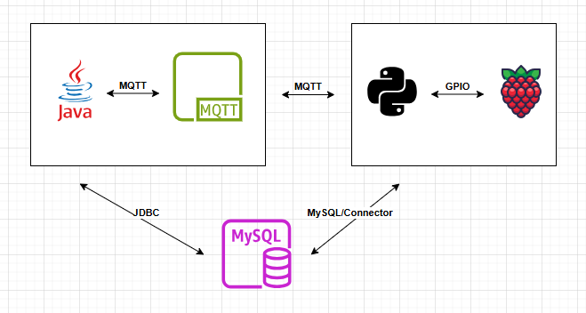
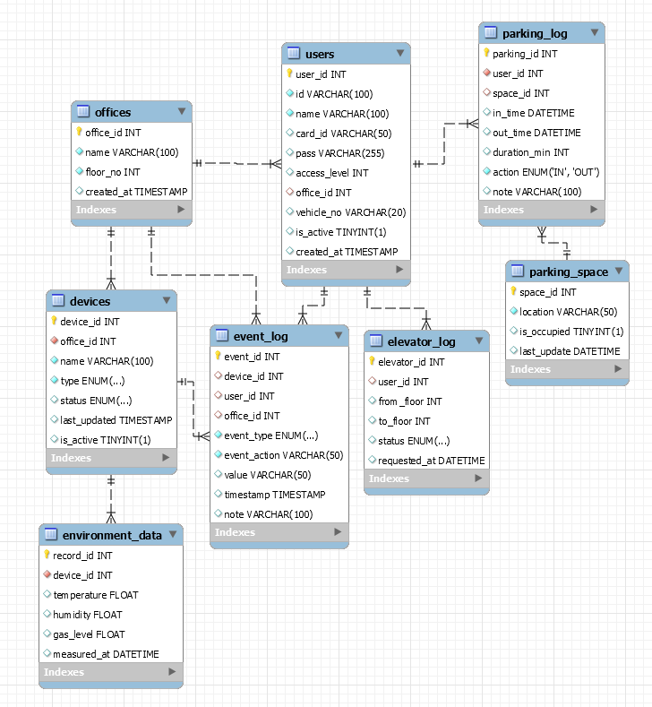

# 📌 Building RCS [빌딩 원격관리 시스템]

## 목차

1. [**서비스 소개**](#서비스-소개)
2. [**프로젝트 기획서**](#프로젝트-기획서)
3. [**주요 기능**](#주요-기능)
4. [**팀원 소개**](#팀원-소개)
5. [**시연 방법**](#시연-방법)

# 서비스 소개
HDC랩스 NOVA FullStack 과정, 1팀의 First 프로젝트 Repository 입니다.</br>
스마트 빌딩을 주제 각 디바이스들에 대한 원격 제어, 자동 데이터 수집 기능을 구현한 서비스입니다.   
권한에 따라 지원되는 서비스를 구분하였으며,</br>
크게 전체통제가 가능한 관리자와, 각 오피스 별 부분 사용자 역할로 구분이 됩니다.

----------------------------

# 프로젝트 기획서

## 프로젝트 구성도
 | **시스템 아키텍처**                        |
 |-------------------------------------|
 |                |

 | **ERD**                             |
 |-------------------------------------|
 |  |

 | **MQTT API**                        |
 |-------------------------------------|
 | |\=

 ## 프로젝트 파일 트리 (JAVA)
```
📦src
 ┣ 📂main
 ┃ ┣ 📂java
 ┃ ┃ ┣ 📜smartbuilding.sql // Database, Tables 생성 시 실행할 sql파일
 ┃ ┃ ┣ 📜Main.java // psvm 메서드로 java를 실행하는 첫 파일
 ┃ ┃ ┣ 📂dao // DB 작업 (CRUD) 을 수행하는 DAO 파일이 들어가는 폴더
 ┃ ┃ ┣ 📂dto // 데이터 전달 형식을 class, DTO 단위로 들어가는 폴더
 ┃ ┃ ┣ 📂mqtt //MqttClient 클래스를 통해 Connect, Sub/Pub 가 구현된 파일 폴더
 ┃ ┃ ┣ 📂controller // 프로젝트에서 주요 기능들을 처리하는 로직8
 ┃ ┃ ┣ 📂service // 각 기능 별로 로직 구현하는 폴더
 ┃ ┃ ┣ 📂util // DB Connection, ANSI Escape Codes 등 static으로 초기 생성하는 데이터
 ┃ ┃ ┣ 📂config // Broker 서버, DB 서버와 관련된 민감정보들이 들어가는 폴더 (깃에 안올림)
 ┃ ┃ ┗ 📂view // 콘솔 화면, UI를 넣는 폴더
```

## 프로젝트 일정 (25.10.21 - 25.10.29)    

| 작업 항목             | 시작 날짜      | 종료 날짜      | 기간(일) |
|-------------------|------------|------------|-------|
| 프로젝트 구조 설계        | 2025-10-21 | 2025-10-22 | 2     |
| 프로젝트 UI 설계        | 2025-10-22 | 2025-10-22 | 1     |
| 프로젝트 기능 구현        | 2025-10-22 | 2025-10-27 | 6     |
| ERD 구조 작성         | 2025-10-23 | 2025-10-25 | 3     |
| MQTT API 설계       | 2025-10-24 | 2025-10-25 | 2     |
| 전체 기능 테스트 및 오류 수정 | 2025-10-27 | 2025-10-28 | 2     |
| 최종 검토 및 발표        | 2025-10-29 | 2025-10-29 | 1     |

## 🛠️ 기술 스택
| 개발환경    | 언어     | 모듈                                | 데이터베이스 |
|---------|--------|-----------------------------------|--------|
| Eclipse | Java   | paho-mqtt<br>mysql-connector-java | MySQL  |
| VSCode  | Python | paho-mqtt<br>RPi.GPIO             | MySQL  |


--------------------------

# 주요 기능

## 1. 기능 요구사항
- [ ] 데이터 수집 기능: [수집 대상 및 방식]
- [ ] 데이터 전처리 기능: [결측치 처리, 이상치 제거 등]
- [ ] 분석 기능: [사용할 알고리즘 또는 분석 기법]
- [ ] 시각화 기능: [대시보드, 차트, 그래프]

## 2. 비기능 요구사항
- [ ] 시스템 안정성: 데이터 처리 시 오류 발생 최소화
- [ ] 성능: 데이터 처리 및 분석 시간 최소화
- [ ] 확장성: 새로운 데이터 추가 및 확장 가능

----------------------------

# 👨‍👩‍👧‍팀원 소개

| 이름  |                  역할 및 담당 기능                  |
|:---:|:--------------------------------------------:|
| 양준길 | PM<br>MQTT 통신 구축<br>프로젝트 일정관리<br>엘리베이터 기능 구현 |     
| 조수민 | ERD 설계 및 DB 연동<br>출입문 기능 구현<br>화재감지센서 데이터 수집 |
| 이희원 |           주차 관리 기능 구현<br>센서 로그 수집            |
| 김광민 |       IoT 조명 제어 기능 구현<br>온습도 센서 로그 수집        |

----------------------------

# 시연 방법
